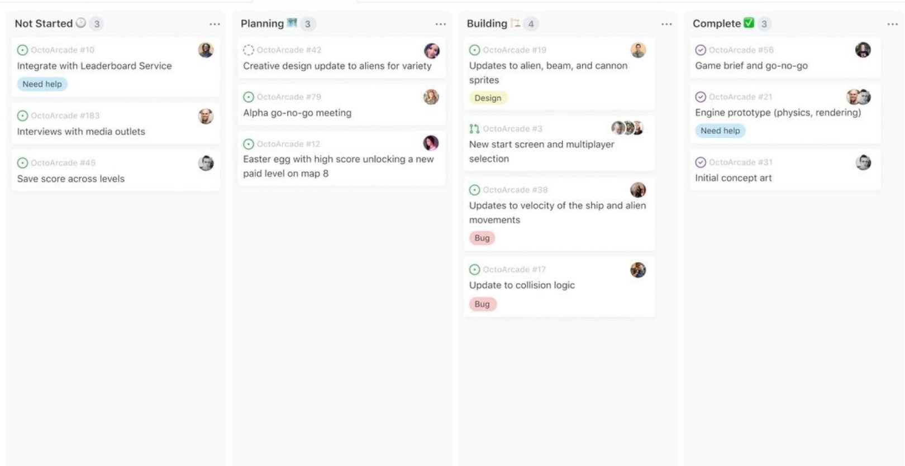
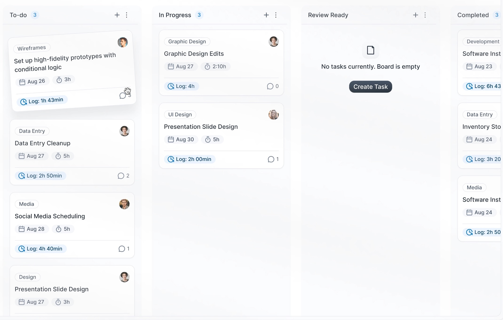
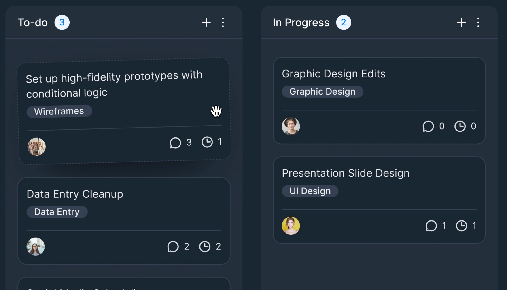

# Kymono Technical Test

Hi dear candidate.

We'd like to know more about how you code. So we bootstraped some frontend app in React (`app` folder) and some Node.js backend API (`api` folder) to help you show us what you can do.
There is also a `models` folder where all the [zod](https://zod.dev/) schemas and types are stored.
You'll have to use them to ensure the data has the correct type.

Feel free to add, edit, delete anything, start from scratch. This is just meant to save you some time.

Once you've finished, make a Pull Request from your branch to `main`.

## Important things

- Take the time you need to make a nice Pull Request you'd do in real life.
- **Use TypeScript** _(and use it well)_

## What we'll look at

- How you learn something you don't know
- How you code (style, algo, mindset)
- What difficulties you encounter
- What you consider (or don't) important

## Instructions

The current `api` has only one hello world route.

We want you to add a route to fetch some todos from [https://jsonplaceholder.typicode.com/todos](https://jsonplaceholder.typicode.com/todos).

Then, create a Kanban in the React app with 3 columns:

- To do
- In Progress
- Done

The fetched todos from the api should be all inside the **To do** column at first.

We should be able to create, edit and delete new items and drag and drop them through the columns.

These are the basics features we want.
Feel free to add more features if you want !

You are free to use any library you want for the UI or for the Kanban creation.

## Some inspirations

---

If you have any question about this test, feel free to email at corentin.godart@kymono.co or chan.nguyen@kymono.co.
